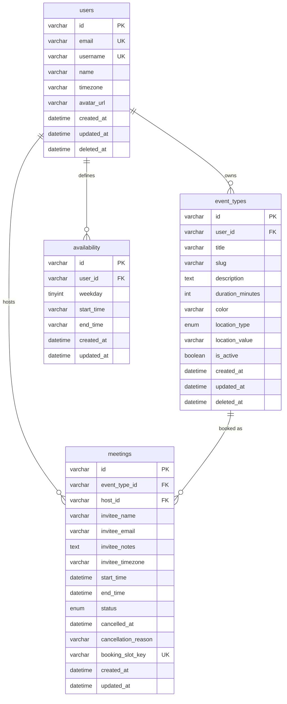

# Database Structure & Schema Design

This document describes the persistence layer for the Calendly clone: the MySQL schema, Prisma models, relationships, constraints, and the design decisions behind them.

**Source of truth:** [`apps/server/prisma/schema.prisma`](../apps/server/prisma/schema.prisma)  
**Initial migration:** [`apps/server/prisma/migrations/20260612142336_init/migration.sql`](../apps/server/prisma/migrations/20260612142336_init/migration.sql)

---

## Overview

| Item                | Value                                                  |
| ------------------- | ------------------------------------------------------ |
| Database            | MySQL                                                  |
| ORM                 | Prisma                                                 |
| Charset / collation | `utf8mb4` / `utf8mb4_unicode_ci`                       |
| Connection          | `DATABASE_URL` environment variable                    |
| Tables              | 4 (`users`, `event_types`, `availability`, `meetings`) |
| Enums               | 2 (`LocationType`, `MeetingStatus`)                    |

The schema models a scheduling product where **hosts** define **event types** (bookable templates), **availability** (weekly recurring windows), and **meetings** (confirmed bookings with invitee details).

---

## Entity Relationship Diagram



---

## Prisma ↔ Table Mapping

| Prisma model       | MySQL table    | Notes                         |
| ------------------ | -------------- | ----------------------------- |
| `User`             | `users`        | Host accounts                 |
| `EventType`        | `event_types`  | Bookable meeting templates    |
| `AvailabilityRule` | `availability` | Weekly recurring time windows |
| `Meeting`          | `meetings`     | Booked sessions               |

Prisma uses **camelCase** in application code; columns are stored in **snake_case** via `@map`.

---

## Enums

### `LocationType` (`event_types.location_type`)

| Value         | Description                         |
| ------------- | ----------------------------------- |
| `google_meet` | Default; Google Meet link (default) |
| `zoom`        | Zoom meeting                        |
| `phone`       | Phone call                          |
| `in_person`   | In-person meeting                   |
| `custom`      | Custom location                     |

Optional detail (phone number, address, custom URL) is stored in `location_value`.

### `MeetingStatus` (`meetings.status`)

| Value       | Description                     |
| ----------- | ------------------------------- |
| `confirmed` | Active booking (default)        |
| `cancelled` | Cancelled; slot may be rebooked |

---

## Tables

### `users`

Host accounts. In the current scaffold, a single seeded user acts as the host.

| Column       | Type           | Nullable | Default                | Constraints                             |
| ------------ | -------------- | -------- | ---------------------- | --------------------------------------- |
| `id`         | `VARCHAR(191)` | NO       | —                      | **PK**, generated as `cuid()`           |
| `name`       | `VARCHAR(120)` | NO       | —                      |                                         |
| `email`      | `VARCHAR(255)` | NO       | —                      | **UNIQUE**                              |
| `username`   | `VARCHAR(60)`  | NO       | —                      | **UNIQUE**; used in public booking URLs |
| `timezone`   | `VARCHAR(64)`  | NO       | `'UTC'`                | IANA timezone string                    |
| `avatar_url` | `VARCHAR(500)` | YES      | —                      |                                         |
| `created_at` | `DATETIME(3)`  | NO       | `CURRENT_TIMESTAMP(3)` |                                         |
| `updated_at` | `DATETIME(3)`  | NO       | —                      | Auto-updated by Prisma                  |
| `deleted_at` | `DATETIME(3)`  | YES      | —                      | Soft delete                             |

**Indexes:** `deleted_at`

**Relations:**

- One user → many `event_types`
- One user → many `availability` rules
- One user → many `meetings` (as host)

---

### `event_types`

A bookable meeting template with a public slug. Each event type belongs to exactly one host.

| Column             | Type           | Nullable | Default                | Constraints                            |
| ------------------ | -------------- | -------- | ---------------------- | -------------------------------------- |
| `id`               | `VARCHAR(191)` | NO       | —                      | **PK**, `cuid()`                       |
| `user_id`          | `VARCHAR(191)` | NO       | —                      | **FK → users.id** (CASCADE)            |
| `title`            | `VARCHAR(120)` | NO       | —                      | Display name                           |
| `slug`             | `VARCHAR(60)`  | NO       | —                      | URL segment; unique per host           |
| `description`      | `TEXT`         | YES      | —                      |                                        |
| `duration_minutes` | `INTEGER`      | NO       | —                      | Meeting length                         |
| `color`            | `VARCHAR(9)`   | NO       | `'#0069ff'`            | UI accent color                        |
| `location_type`    | `ENUM(...)`    | NO       | `google_meet`          | See `LocationType`                     |
| `location_value`   | `VARCHAR(255)` | YES      | —                      | Phone, address, etc.                   |
| `is_active`        | `BOOLEAN`      | NO       | `true`                 | Inactive types are hidden from booking |
| `created_at`       | `DATETIME(3)`  | NO       | `CURRENT_TIMESTAMP(3)` |                                        |
| `updated_at`       | `DATETIME(3)`  | NO       | —                      |                                        |
| `deleted_at`       | `DATETIME(3)`  | YES      | —                      | Soft delete                            |

**Unique constraints:** `(user_id, slug)` — public URLs like `/{username}/{slug}` never collide per host.

**Indexes:** `user_id`, `(user_id, is_active)`, `deleted_at`

**Relations:**

- Many event types → one `users`
- One event type → many `meetings`

---

### `availability`

Weekly recurring availability windows for a host. One row represents one weekday time range (e.g. Monday 09:00–17:00). A host can have multiple rows per weekday for split schedules.

| Column       | Type           | Nullable | Default                | Constraints                                           |
| ------------ | -------------- | -------- | ---------------------- | ----------------------------------------------------- |
| `id`         | `VARCHAR(191)` | NO       | —                      | **PK**, `cuid()`                                      |
| `user_id`    | `VARCHAR(191)` | NO       | —                      | **FK → users.id** (CASCADE)                           |
| `weekday`    | `TINYINT`      | NO       | —                      | `0` = Sunday … `6` = Saturday                         |
| `start_time` | `VARCHAR(5)`   | NO       | —                      | `"HH:mm"` in host timezone                            |
| `end_time`   | `VARCHAR(5)`   | NO       | —                      | `"HH:mm"`; must be after `start_time` (app-validated) |
| `created_at` | `DATETIME(3)`  | NO       | `CURRENT_TIMESTAMP(3)` |                                                       |
| `updated_at` | `DATETIME(3)`  | NO       | —                      |                                                       |

**Indexes:** `user_id`, `(user_id, weekday)`

**Notes:**

- No soft delete; availability is replaced wholesale on update (see seed pattern).
- Times are stored as strings, not `TIME` columns, to keep timezone interpretation in application logic.

---

### `meetings`

A booked session between a host and an invitee.

| Column                | Type           | Nullable | Default                | Constraints                       |
| --------------------- | -------------- | -------- | ---------------------- | --------------------------------- |
| `id`                  | `VARCHAR(191)` | NO       | —                      | **PK**, `cuid()`                  |
| `event_type_id`       | `VARCHAR(191)` | NO       | —                      | **FK → event_types.id** (CASCADE) |
| `host_id`             | `VARCHAR(191)` | NO       | —                      | **FK → users.id** (CASCADE)       |
| `invitee_name`        | `VARCHAR(120)` | NO       | —                      |                                   |
| `invitee_email`       | `VARCHAR(255)` | NO       | —                      |                                   |
| `invitee_notes`       | `TEXT`         | YES      | —                      |                                   |
| `invitee_timezone`    | `VARCHAR(64)`  | NO       | —                      | IANA timezone                     |
| `start_time`          | `DATETIME(3)`  | NO       | —                      | UTC stored                        |
| `end_time`            | `DATETIME(3)`  | NO       | —                      | UTC stored                        |
| `status`              | `ENUM(...)`    | NO       | `confirmed`            | See `MeetingStatus`               |
| `cancelled_at`        | `DATETIME(3)`  | YES      | —                      | Set on cancellation               |
| `cancellation_reason` | `VARCHAR(500)` | YES      | —                      |                                   |
| `booking_slot_key`    | `VARCHAR(120)` | YES      | —                      | **UNIQUE**; double-booking guard  |
| `created_at`          | `DATETIME(3)`  | NO       | `CURRENT_TIMESTAMP(3)` |                                   |
| `updated_at`          | `DATETIME(3)`  | NO       | —                      |                                   |

**Unique constraints:** `booking_slot_key`

**Indexes:**

- `(host_id, start_time)` — host calendar / conflict checks
- `(event_type_id, start_time)` — per-event-type listings
- `(host_id, status, start_time)` — filtered lists (upcoming, past, cancelled)
- `invitee_email` — lookup by invitee

**Relations:**

- Many meetings → one `event_types`
- Many meetings → one `users` (host)

**Notes:**

- No soft delete; cancellation is modeled via `status`, `cancelled_at`, and clearing `booking_slot_key`.
- `host_id` is denormalized from `event_types.user_id` for efficient host-scoped queries without joining event types.

---

## Foreign Keys

All foreign keys use `ON DELETE CASCADE` and `ON UPDATE CASCADE`.

| Child table    | Column          | Parent           | On delete |
| -------------- | --------------- | ---------------- | --------- |
| `event_types`  | `user_id`       | `users.id`       | CASCADE   |
| `availability` | `user_id`       | `users.id`       | CASCADE   |
| `meetings`     | `event_type_id` | `event_types.id` | CASCADE   |
| `meetings`     | `host_id`       | `users.id`       | CASCADE   |

Deleting a user removes their event types, availability rules, and meetings. Soft-deleting users/event types preserves historic meeting rows via FK integrity.

---

## Design Decisions

### Primary keys: `cuid()`

All tables use string primary keys generated by Prisma's `cuid()`. Benefits:

- Collision-resistant without coordination
- Safe to expose in URLs and API responses
- No sequential ID enumeration

### Soft delete (`deleted_at`)

Applied to `users` and `event_types` only:

- Queries filter `deletedAt: null` for active records
- Historic `meetings` retain valid foreign keys to soft-deleted parents
- Hard deletes are avoided for entities that appear in booking history

`availability` and `meetings` do not use soft delete.

### Audit timestamps

Every table has `created_at` and `updated_at` (millisecond precision). Prisma manages `updated_at` via `@updatedAt`.

### Double-booking prevention

`meetings.booking_slot_key` enforces at most one **confirmed** booking per host at a given start time:

```
booking_slot_key = "{hostId}:{startTimeUtcIso}"
```

- Set when a meeting is **confirmed**
- Set to `NULL` on **cancellation**
- MySQL allows multiple `NULL` values in a unique index, so cancelled slots can be rebooked while active slots remain globally unique

Concurrent inserts for the same slot hit the unique constraint (Prisma `P2002`) and are mapped to HTTP `409 DOUBLE_BOOKING` in the API layer. This pushes correctness into the database rather than relying on read-then-write checks that race under load.

### Index strategy

Indexes target known query paths:

| Query pattern                      | Index                                 |
| ---------------------------------- | ------------------------------------- |
| List active event types for a host | `(user_id, is_active)`                |
| Host calendar / slot availability  | `(host_id, start_time)`               |
| Meetings by event type             | `(event_type_id, start_time)`         |
| Filtered meeting lists             | `(host_id, status, start_time)`       |
| Availability for a weekday         | `(user_id, weekday)`                  |
| Soft-delete filtering              | `deleted_at` on users and event types |

### Denormalization

`meetings.host_id` duplicates `event_types.user_id`. This avoids a join on every host-scoped meeting query and supports the `booking_slot_key` format `{hostId}:{startISO}`.

---

## Application Layer Mapping

Prisma entities are mapped to API DTOs defined in `@calendly/shared` (Zod schemas). The shared package is the wire contract; the database schema is the persistence contract.

| DB table       | Shared schema                                         | Exposed fields                                                                            |
| -------------- | ----------------------------------------------------- | ----------------------------------------------------------------------------------------- |
| `users`        | `userSchema`                                          | Full user (dashboard); `publicHostSchema` omits `id`, `email`, timestamps on public pages |
| `event_types`  | `eventTypeSchema`                                     | Full event type entity                                                                    |
| `availability` | `availabilityRuleSchema` / `weeklyAvailabilitySchema` | Grouped by host timezone + rules array                                                    |
| `meetings`     | `meetingSchema`                                       | Includes optional embedded `eventType` summary                                            |

Fields **not** exposed on the API include `deleted_at`, `booking_slot_key`, and internal FK columns where redundant (e.g. `hostId` is returned on meetings).

---

## Migrations & Seeding

### Running migrations

From `apps/server`:

```bash
npx prisma migrate deploy   # apply pending migrations
npx prisma migrate dev        # dev: create/apply migrations
```

### Seed data

[`apps/server/prisma/seed.ts`](../apps/server/prisma/seed.ts) is idempotent and creates:

| Entity       | Values                                                              |
| ------------ | ------------------------------------------------------------------- |
| User         | `demo@calendly.clone`, username `demo`, timezone `America/New_York` |
| Event types  | `30min` (30 min, Google Meet), `15min-intro` (15 min, phone)        |
| Availability | Mon–Fri (`weekday` 1–5), 09:00–17:00                                |

Run with:

```bash
npx prisma db seed
```

---

## Summary

The schema is intentionally small: four tables cover hosts, bookable templates, recurring availability, and bookings. Key properties:

1. **Explicit foreign keys** with cascade deletes for structural cleanup
2. **Soft deletes** where history matters (`users`, `event_types`)
3. **Database-enforced uniqueness** for double-booking via `booking_slot_key`
4. **Indexes aligned to API query paths** (host calendar, filtered meeting lists, public event lookup)
5. **Prisma as the single schema definition**, with one initial migration and shared Zod types for API validation

For broader system context (API layers, frontend, booking flow), see [`ARCHITECTURE.md`](./ARCHITECTURE.md).
